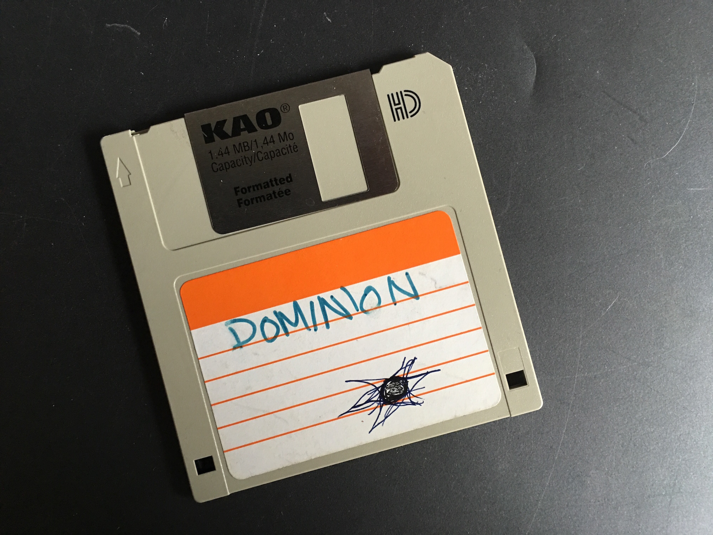
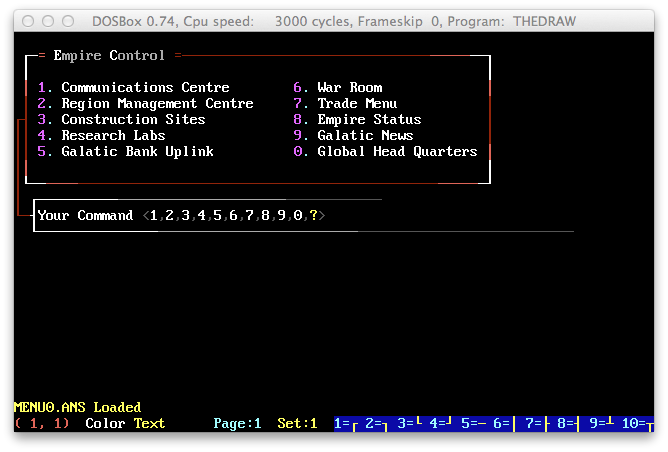
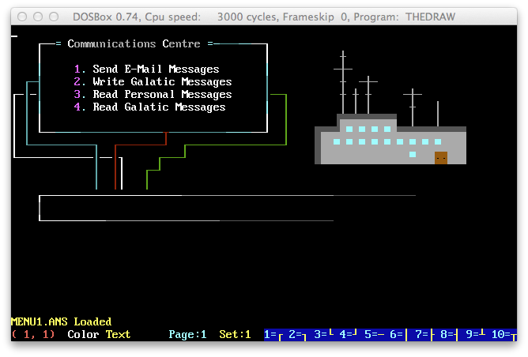
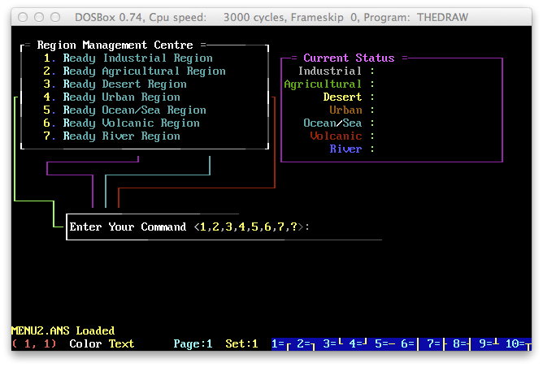
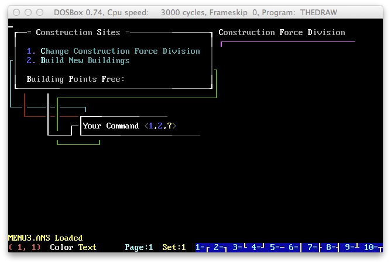
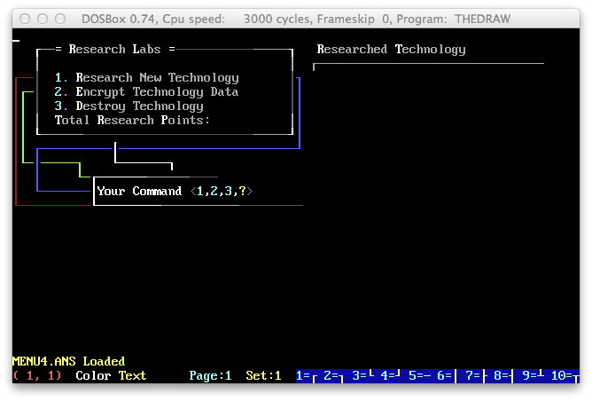
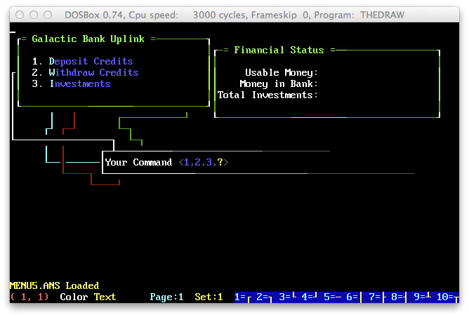
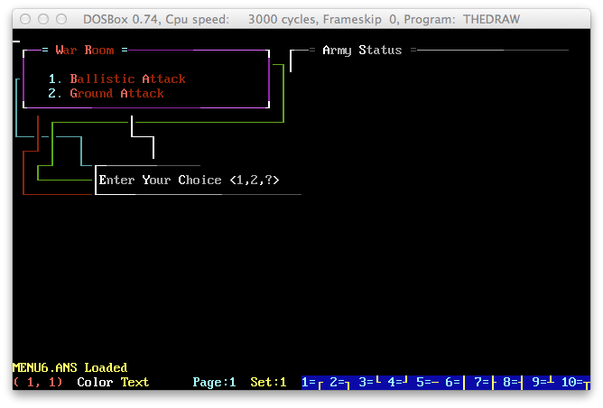
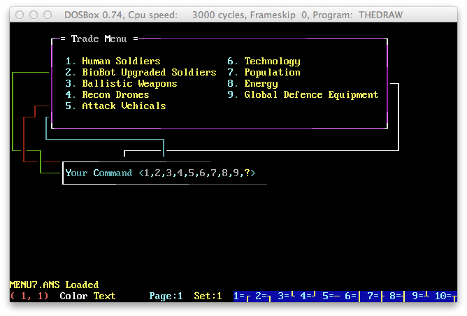
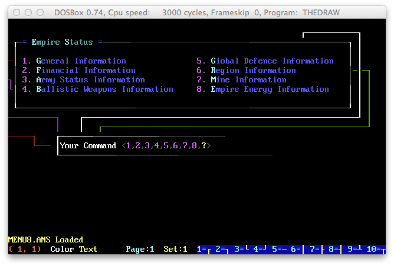

# DOMINION

## InterDoor Status

Dominion/Empire Ascendant is not part of InterDoor Phase 1. Phase 1 is the federated
framework: hub, protocol, node sync, SDK surface, operator tooling, and tests.

The faulty Go implementation previously added under `games/ledgerofthelow/cmd/dominion`
and `games/ledgerofthelow/internal/dominion` has been quarantined under
`quarantine/2026-06-24-faulty-implementation/` as historical material only. Do not build,
release, deploy, or use that code as architecture authority.

Any future Empire Ascendant work must start from this original Dominion material, receive its
own design review, and be approved as a separate game phase before code is added back to the
active InterDoor build surface.

It's a door game I was hacking on when I was in highschool in 1996 (Grade 11).

Never finished it... but hey. Here it is, in all of its Turbo Pascal glory.

## A bit of history

The best I can remember it anyways. 

I wrote much of this game for my Grade 11 computer science class. Though I don't actually remember learning
a lot of actual comp. sci. 

At the time a couple of us ran a small BBS system from some old hardware we scrapped 
together around the highschool. I remember begging our principal for a 14.4kbps model so we can serve our users
better. The 9600bps we had was quite slow even by 1996 standards. She managed to help us out with hundred
dollars out of our tiny school budget for a 28.8kbps model. 

It's taken me almost two decades to appreciate that. Damn. 

Anyways, we ran this little BBS called the Infinity BBS. It was one of three BBS systems
that we had in Prince Rupert. The other were ran by two friends of mine. One, 
the Junkyard BBS would be my first experience with email. Of course, not knowing
anybody outside of Prince Rupert, I didn't have anybody to email. 

To be as popular as the Junkyard BBS was our highschool dreams. I mean, Keith had TWO 
phone lines, multiple CD ROMS of content and email (well sort of). Our little BBS
ran out of a back room of the school's computer lab. 

Actually, it started out in the lab itself. As word got out about our little BBS
the random modem [ping, boop, wrrrs](https://www.youtube.com/watch?v=vvr9AMWEU-c) throughout the day 
would interrupt the class. That gave us the purest form of geek joy that I can remember. 

About that time is when I started writing Dominion. It was to be like Legend of the
Red Dragon, Usurper and Trade Wars 2000 which were so popular at the time. I never
quite finished it however, spending way too much time on getting the cursor to 
blink green and print like a slow retro-futuristic terminal. 

Regardless, here it is. Finding code from your childhood is as nostalgic as 
finding old vacation photos. Enjoy. 

## The `.ANS` files

These require the awesome [TheDraw](http://en.wikipedia.org/wiki/TheDraw) program to open and 
edit these files. Unfortunatly it's DOS based but works great in [DosBox](http://www.dosbox.com/). 

Here's what they look like. _Warning awesome programmer ANSI art ahead!_

### MENU0.ans

### MENU1.ans

### MENU2.ans

### MENU3.ans

### MENU4.ans

### MENU5.ans

### MENU6.ans

### MENU7.ans

### MENU8.ans

## License

See LICENSE.txt
